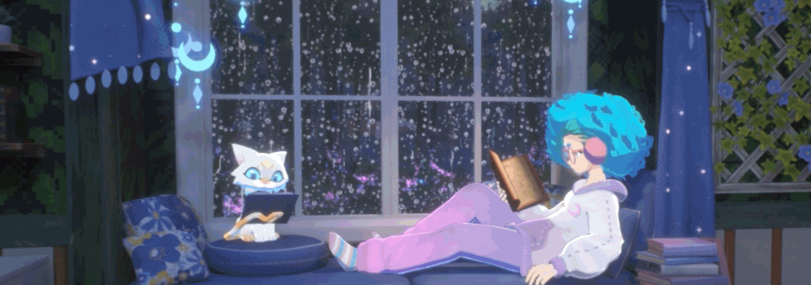

# Hi, I'm MINA! 👋

By day, I'm a web designer, and by night, I write codes.

## 🚀 About Me

- 🔭 I am an alumna of iACADEMY with a Bachelor of Arts degree in Multimedia Arts & Design.
- 🌐 Founder of [coteriecreates.art](https://coteriecreates.art); the creative nest for elevating brands and uniting ideas.
- ✍️ Currently designing my portfolio website: [minaco.art](https://minaco.art)

## My Articles
- [On Hiatus](https://plumrain.hatenablog.com/)

## Tech Stack

## 🌱 Currently Exploring

- 🚀 Learning UI/UX design
  - Styling with Tailwind CSS to create modern and responsive user interfaces.
  - Taking online courses on Figma and Adobe XD.

 ## 🏆 Achievements

- 🌟 I published [HUGIS.ORG](https://hugis.org) for my school thesis; a non-profit virtual photography exhibition that aims to celebrate, educate, and promote scoliosis awareness.

## 📬 Get in Touch

- Connect with me on [Twitter (X)](https://x.com/CyanicOrange)
- Visit my website at [minaco.art](https://minaco.art)

Thanks for stopping by! Let's connect and explore the fascinating world of technology together. 🚀

<!--

Here are some ideas to get you started:

- 🔭 I’m currently working on ...
- 🌱 I’m currently learning ...
- 👯 I’m looking to collaborate on ...
- 🤔 I’m looking for help with ...
- 💬 Ask me about ...
- 📫 How to reach me: ...
- 😄 Pronouns: ...
- ⚡ Fun fact: ...
-->
